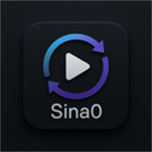
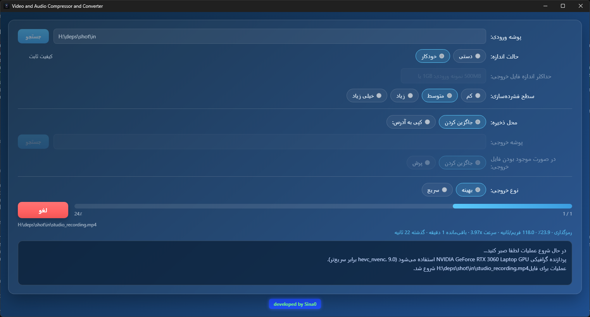

<p align="center">
  
</p>

<h1 align="center">Video Converter</h1>

<p align="center">
  Shrink and convert whole folders of video and audio — to an exact size or a quality level — in one click.<br>
  Windows · macOS · Linux
</p>

<p align="center">
  <a href="https://github.com/sinafarahani/video-converter/releases/latest"></a>
  <a href="https://github.com/sinafarahani/video-converter/releases"></a>
  <a href="LICENSE"></a>
</p>

<p align="center"><a href="#راهنمای-فارسی">راهنمای فارسی</a></p>



Point it at a folder, choose how small you want the files, press start. Every
video inside — including subfolders — becomes an H.265 MP4, and every audio file
an MP3. It uses your graphics card when that is genuinely faster, keeps only the
audio tracks that actually contain sound, and shows exactly how far along it is.

> The interface is in Persian (فارسی). Every control is explained below.

## Features

- **Exact size (Manual)** — give a maximum size per file, such as `1GB` or
  `500MB`, and each video is encoded in two passes to land just under it.
  Files that are already smaller are copied across untouched instead of being
  re-encoded larger.
- **Quality levels (Automatic)** — or pick one of four compression levels and
  let the size fall where it may.
- **GPU acceleration** — NVIDIA (NVENC), AMD (AMF), Intel Arc (Quick Sync) and
  Apple (VideoToolbox) encoders are used automatically, but only when the app
  measures them to be at least twice as fast as your CPU. Old Intel HD/UHD
  integrated graphics are deliberately skipped.
- **Smart audio tracks** — studio recordings often carry several microphone
  tracks of which only one is live. Every track is measured; silent and
  noise-only tracks are dropped, and a stereo pair stored as two mono tracks
  (the usual broadcast MXF layout) is joined back into one stereo track.
- **Replace or copy** — overwrite the originals in place, or write the results
  to another folder with the same subfolder structure, skipping or replacing
  files that are already there.
- **Honest progress** — the current phase, per-file percentage, frames per
  second, speed and time remaining, plus a warning if an encode stalls.
- **No administrator rights needed** to install, on any platform.
- **Wide format support** — MP4, MKV, MOV, AVI, MXF, WebM, WMV, FLV, TS/M2TS,
  3GP, OGV and more for video; MP3, WAV, FLAC, AAC, OGG, Opus, WMA, M4A, APE and
  more for audio.

## Download

Get the file for your system from the
**[latest release](https://github.com/sinafarahani/video-converter/releases/latest)**:

| System | File |
|---|---|
| Windows 10 / 11 | `VideoConverter-<version>-windows-x64-setup.exe` |
| Windows, no install | `VideoConverter-<version>-windows-x64-portable.zip` |
| macOS, Apple Silicon (M1 and later) | `VideoConverter-<version>-macos-arm64.dmg` |
| macOS, Intel | `VideoConverter-<version>-macos-x64.dmg` |
| Linux x86-64 | `VideoConverter-<version>-linux-x64.tar.gz` |

FFmpeg is included; nothing else needs to be installed.

## Install

The app is free and not signed with a paid Apple or Microsoft certificate, so
both systems warn the first time you open it. This is expected.

### Windows

Run the setup file. If **"Windows protected your PC"** appears, click
**More info → Run anyway**. It installs for your user account only — no
administrator rights — and adds Start menu and desktop shortcuts. Uninstall it
from *Settings → Apps* like any other program.

Prefer not to install? Unzip the portable package anywhere and run
`converter.exe`.

### macOS

Open the `.dmg` and drag **Video Converter** into **Applications**. The first
time you open it, macOS will refuse; go to
**System Settings → Privacy & Security**, scroll down and click **Open Anyway**.
You only need to do this once.

If you prefer the Terminal:

```sh
xattr -dr com.apple.quarantine "/Applications/Video Converter.app"
```

### Linux

```sh
tar xf VideoConverter-*-linux-x64.tar.gz
cd VideoConverter-*-linux-x64
./install.sh
```

This installs into `~/.local` for your user only (no `sudo`) and adds the app to
your application menu. Run `./install.sh --uninstall` to remove it. Most desktop
distributions already have the libraries it needs; on a minimal system install
`libnss3 libatk-bridge2.0-0 libcups2 libxkbcommon0 libxcomposite1 libxdamage1
libxrandr2 libgbm1 libasound2` (names may carry a `t64` suffix on newer Ubuntu).

## How to use

| Control | Meaning |
|---|---|
| **پوشه ورودی** — Input folder | The folder to process. Subfolders are included. |
| **حالت اندازه** — Size mode | **دستی** (Manual): a maximum size per file. **خودکار** (Automatic): a quality level. |
| **حداکثر اندازه فایل خروجی** — Maximum size | Manual mode. `1GB`, `500MB`, or a bare number (under 16 means GB, otherwise MB). |
| **سطح فشرده‌سازی** — Compression level | Automatic mode. **کم** (Low, best quality) · **متوسط** (Medium) · **زیاد** (High) · **خیلی زیاد** (Extreme, smallest files). |
| **محل ذخیره** — Where to save | **جاگزین کردن** (Replace): overwrite the originals. **کپی به آدرس** (Copy to): write to the output folder. |
| **در صورت موجود بودن فایل خروجی** — If the output exists | Copy mode only. **جاگزین کردن** (Replace) or **پرش** (Skip). |
| **نوع خروجی** — Encoding speed | **بهینه** (Optimal): smallest files, slowest. **سریع** (Fast): quicker, slightly larger. |
| **شروع / لغو** — Start / Cancel | Cancelling stops immediately and removes any half-written file. |

Files that are neither video nor audio are left alone and are not copied.

**Tip:** *Optimal* on a CPU is very slow — hours per hour of 1080p footage.
With a supported graphics card the same job typically takes minutes.

### Where are the logs?

Every run writes a detailed log, including the exact FFmpeg commands, which GPU
was used and why, and how close each file landed to its target size:

| System | Folder |
|---|---|
| Windows | `%LOCALAPPDATA%\VideoConverter\logs` |
| macOS | `~/Library/Application Support/VideoConverter/logs` |
| Linux | `~/.local/share/VideoConverter/logs` |

## Troubleshooting

**My graphics card isn't being used.** The log says why on its `Encoder:` line.
If the GPU was found but its encoder "failed to run", update the graphics
driver — the bundled FFmpeg needs a recent NVIDIA driver. If it was "not fast
enough", the CPU won the benchmark; the test is repeated after a day or after
an update. Intel HD/UHD integrated graphics are never used, by design.

**It seems stuck.** The progress line shows frames per second and speed even
when the percentage moves slowly; a long file on a CPU in *Optimal* mode can
take many hours. If FFmpeg genuinely stops reporting, a warning appears in the
log pane after 15 minutes.

**The output is a little over the target.** With a GPU the result can land a
few percent above the requested size; software encoding lands just under it.
The log reports the exact figure for every file.

## Building from source

See **[docs/DEVELOPMENT.md](docs/DEVELOPMENT.md)**. In short: C++20 with CMake,
[CEF](https://bitbucket.org/chromiumembedded/cef) for the window, Vue 3 for the
interface, and FFmpeg run as a separate program. Releases are built by
[GitHub Actions](.github/workflows/release.yml) for all four platforms.

## License

**Free to use, modify and share — not to sell.** Video Converter is released
under the [MIT license with the Commons Clause](LICENSE):

- ✅ Use it anywhere, including at work and in companies, for free.
- ✅ Change the code, and share your changes.
- ❌ Sell it, or sell a product or service whose value comes mainly from it.

Bundled third-party software keeps its own license: FFmpeg (GPL v3), the
Chromium Embedded Framework (BSD) and others — see
[THIRD-PARTY-NOTICES.md](THIRD-PARTY-NOTICES.md).

---

<div dir="rtl">

## راهنمای فارسی

**مبدل ویدیو** پوشه‌های کامل ویدیو و صدا را با یک کلیک تبدیل و فشرده می‌کند — یا دقیقاً تا اندازه‌ای که تعیین می‌کنید، یا با یک سطح کیفیت ثابت. همه ویدیوها (از جمله زیرپوشه‌ها) به MP4 با کدک H.265 و همه فایل‌های صوتی به MP3 تبدیل می‌شوند.

### امکانات

- **حالت دستی:** حداکثر اندازه هر فایل را تعیین کنید (مثلاً `1GB` یا `500MB`). فایل‌هایی که از قبل کوچک‌تر هستند بدون فشرده‌سازی منتقل می‌شوند.
- **حالت خودکار:** چهار سطح فشرده‌سازی — کم، متوسط، زیاد و خیلی زیاد — با کیفیت ثابت.
- **استفاده خودکار از کارت گرافیک** (NVIDIA، AMD، Intel Arc و Apple)، فقط در صورتی که حداقل دو برابر سریع‌تر از پردازنده باشد. کارت‌های گرافیک مجتمع Intel HD/UHD استفاده نمی‌شوند.
- **انتخاب هوشمند مسیر صوتی:** مسیرهای بی‌صدا یا دارای نویز حذف می‌شوند و فقط مسیرهای دارای صدای واقعی نگه داشته می‌شوند. جفت‌های استریو در فایل‌های MXF به یک مسیر استریو تبدیل می‌شوند.
- جایگزینی فایل‌های اصلی یا کپی در پوشه‌ای دیگر با حفظ ساختار زیرپوشه‌ها.
- نمایش مرحله، درصد، سرعت و زمان باقی‌مانده.
- نصب بدون نیاز به دسترسی مدیر سیستم (Administrator).

### دانلود و نصب

فایل مناسب سیستم خود را از بخش **[Releases](https://github.com/sinafarahani/video-converter/releases/latest)** دانلود کنید. FFmpeg همراه برنامه است و نیازی به نصب جداگانه ندارد.

**ویندوز:** فایل `windows-x64-setup.exe` را اجرا کنید. اگر پیغام «Windows protected your PC» نمایش داده شد، روی **More info** و سپس **Run anyway** کلیک کنید. نسخه بدون نصب (`portable.zip`) را هم می‌توانید در هر پوشه‌ای باز کنید و `converter.exe` را اجرا کنید.

**مک:** فایل `dmg` مناسب را باز کنید (پردازنده‌های Apple Silicon: `macos-arm64` — پردازنده‌های اینتل: `macos-x64`) و برنامه را به پوشه Applications بکشید. در اولین اجرا به **System Settings → Privacy & Security** بروید و روی **Open Anyway** کلیک کنید.

**لینوکس:**

</div>

```sh
tar xf VideoConverter-*-linux-x64.tar.gz
cd VideoConverter-*-linux-x64
./install.sh
```

<div dir="rtl">

### نحوه استفاده

۱. **پوشه ورودی** را انتخاب کنید (همه زیرپوشه‌ها هم پردازش می‌شوند).<br>
۲. **حالت اندازه** را انتخاب کنید: **دستی** با تعیین حداکثر اندازه، یا **خودکار** با انتخاب سطح فشرده‌سازی.<br>
۳. **محل ذخیره** را انتخاب کنید: جایگزین کردن فایل‌های اصلی، یا کپی در پوشه خروجی.<br>
۴. **بهینه** کمترین حجم را می‌دهد ولی کندتر است؛ **سریع** سریع‌تر است و حجم کمی بیشتر.<br>
۵. روی **شروع** کلیک کنید. با **لغو** عملیات فوراً متوقف و فایل نیمه‌کاره حذف می‌شود.

فایل‌های لاگ در این مسیرها ذخیره می‌شوند: ویندوز `%LOCALAPPDATA%\VideoConverter\logs` — مک `~/Library/Application Support/VideoConverter/logs` — لینوکس `~/.local/share/VideoConverter/logs`

### مجوز

استفاده، تغییر و انتشار این برنامه برای همه — از جمله سازمان‌ها و شرکت‌ها — **رایگان** است؛ اما **فروش** برنامه، یا فروش محصول یا خدماتی که ارزش آن عمدتاً از این برنامه باشد، مجاز نیست (مجوز MIT همراه با Commons Clause).

</div>
